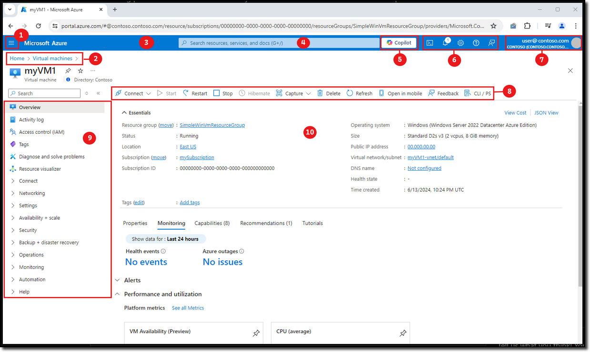
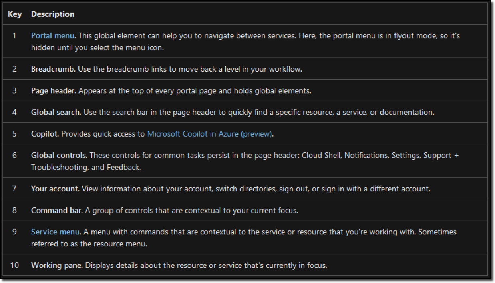
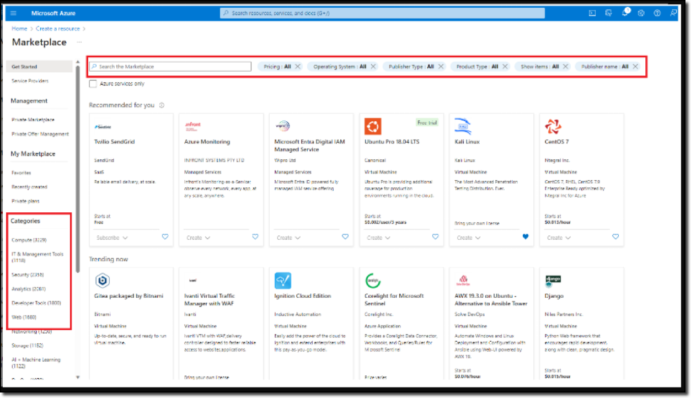

### Azure Portal

The Azure portal is a web-based, unified console that lets you create and manage all your Azure resources. With the Azure portal, you can manage your Azure subscription using a graphical user interface. You can build, manage, and monitor everything from simple web apps to complex cloud deployments in the portal. For example, you can set up a new database, increase the compute power of your virtual machines, and monitor your monthly costs. You can review all available resources, and use guided wizards to create new ones.

The Azure portal is designed for resiliency and continuous availability. It has a presence in every Azure datacenter. This configuration makes the Azure portal resilient to individual datacenter failures and helps avoid network slowdowns by being close to users. The Azure portal updates continuously, and it requires no downtime for maintenance activities. You can access the Azure portal with any supported browser.

### Azure Resource Group

An Azure Resource Group is a container that enables you to manage related resources for an Azure solution. By using the resource group, you can coordinate changes to the related resources. For example, you can deploy an update to the resource group and have confidence that the resources are updated in a coordinated operation. Or, when you're finished with the solution, you can delete the resource group and know that all of the resources are deleted.

There are some important factors to consider when defining your resource group:

- All the resources in your resource group should share the same lifecycle. You deploy, update, and delete them together. If one resource, such as a server, needs to exist on a different deployment cycle it should be in another resource group.
- Each resource can exist in only one resource group.
- You can add or remove a resource to a resource group at any time.
- You can move a resource from one resource group to another group.
- The resources in a resource group can be located in different regions than the resource group, but it's recommended that you use the same location.
- A resource group can be used to scope access control for administrative actions. To manage a resource group, you can assign Azure Policies, Azure roles, or resource locks.
- You can apply tags to a resource group. The resources in the resource group don't inherit those tags.
- A resource can connect to resources in other resource groups. This scenario is common when the two resources are related but don't share the same lifecycle. For example, you can have a web app that connects to a database in a different resource group.
- When you delete a resource group, all resources in the resource group are also deleted.
- You can deploy up to 800 instances of a resource type in each resource group. Some resource types are exempt from the 800 instance limit. For more information, see resource group limits.  <https://learn.microsoft.com/en-us/azure/azure-resource-manager/management/resources-without-resource-group-limit>
- Some resources can exist outside of a resource group. These resources are deployed to the subscription, management group, or tenant. Only specific resource types are supported at these scopes.
- To create a resource group, you can use the portal, Azure Resource Manager REST API, PowerShell, Azure CLI, ARM templates, and IaC tools, to name a few.

### Azure Marketplace

Azure Marketplace is an online store for solutions that are built on or built for Azure and intended for IT professionals and developers. Buyers can access Azure Marketplace in the Azure portal or access the Azure Marketplace online store on the web. The Azure Marketplace online store includes listings for consulting and managed services. Azure Marketplace consulting services are professional service offerings that help customers get started with or accelerate the use of Azure.
Azure Marketplace is a part of Azure, so you can access the catalog of Azure Marketplace solutions in the Azure portal through the **Create a resource** option. This option opens Azure Marketplace within the Azure portal, where you can search for solutions by name or by category.

**Continue to Chapter 2 - Task 2: Azure Networking Concepts**