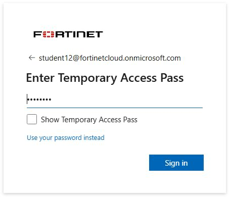

### Lab Environment

- This lab is configured to allow each student to have their own training lab environment using pre-created Azure resource groups all in one shared Azure Subscription.

### Azure Portal Lab Access

- First, you must log in to the Azure Portal. Then, you will gain access to the lab environment.

### To access the Azure Portal sign-in page

1. Open a browser and access the following URL:

    - <https://portal.azure.com>

1. Use the credentials shared with you by your instructors.

    - **Username**:  "**<studentxx@fortinetcloud.onmicrosoft.com>**"
1. Enter Temporary access credentials
   - 

1. Click **Sign in**.
1. Click **No** on the 'Stay signed in?' prompt
1. Click **Get started** on the 'Welcome to Microsoft Azure' page.
1. Click **Skip** on the 'How do you plan to use Azure' page.
1. Click **Skip** on the 'Now, let show you around Azure' page.
1. Click on the **Home** link in the upper left corner.

    

1. Click on **Resource Groups** in the main page.

    

1. Confirm your resource group is shown.

    

**Continue to Chapter 4:  Deploy a VNET**