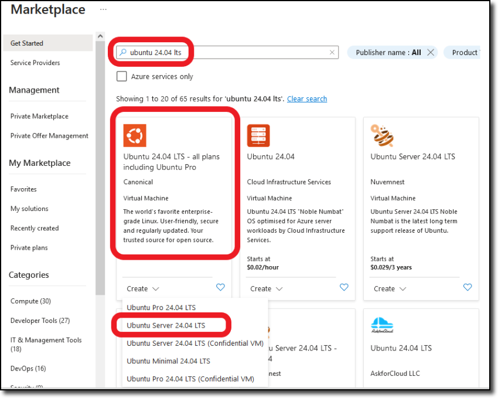
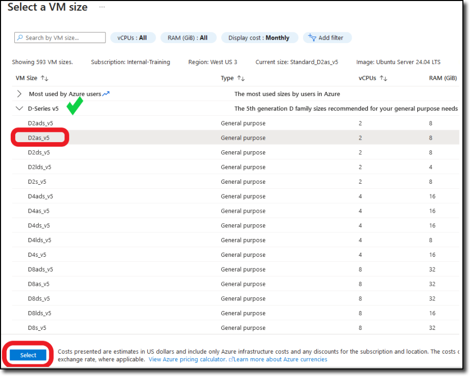

Now that you have a **VNET** deployed, you are going to deploy a Linux VM and confirm access to the Internet and identify the assigned public IP (PIP).

 **Creation Steps**
    - 1. Navigate into your Resource Group and click on the **+ Create** located at the top left of the tool bar.
  

You will be redirected to the Azure Marketplace.

In the Marketplace search bar, enter **ubuntu 24.04 lts** and then enter.  Navigate to the **Ubuntu 24.04 LTS - all plans including Ubuntu Pro** offering from **Canonical** and select **Create** and **Ubuntu Server 24.04 LTS**.

You will be redirected to the **Create a virtual machine** template.

- Under the **Basics** tab, update the following fields:
(Leave the default entry of the other fields not listed here)
    - **Resource group**:  "**studentxx-azure102-rg**"
    - **Virtual machine name**:  "**Linux-VM**"
    - **Availability options**:  "**No infrastructure redundancy required**"
    - **Security type**:  "**Standard**"
    - **Size**:  Select "**See all sizes**"

    - On the **Select a VM size** screen, expand the **D-Series v5** section and select "**D2as_v5**" and then click **Select**.

    
    - Continuing from the **Create a virtual machine** screen,
    - **Authentication type**:  "**Password**"
    - **Username**:  "**studentxx**"  (Replace xx with your student number)
    - **Password**:  "**FortinetAzure2024!**" (Same as your Azure portal login)
    - **Confirm password**:  "**FortinetAzure2024!**"

- Confirm the changes and the other fields default entries match the following diagram.

- Select **Next: Disks >**.

- On the **Disk** tab, keep the default settings and click **Next:Networking >**.
Feel free to read through the available disk services that can be changed/enabled.

- Under the **Networking** tab, update the following fields:
(Leave the default entry of the other fields not listed here)
    - **Virtual network**:  "**Studentxx_VNET**"
    - **Subnet**:  "**Protected-A_Subnet (192.168.1.128/27)**"
    - **Public IP**:  Select **Create new**
        - On the new **Create public IP address** on the right, enter the following:
        - **Name**:  "**Linux-VM_PIP**"
        - **Routing preference**:  "**Internet**"
        - Select **OK**
    - **Delete public IP and NIC when VM is deleted**:  **Select**

- Confirm the changes and the other fields default entries match the following diagram.

- Select **Review + create >**.

- Feel free to read through the **Management**, **Monitoring**, **Advanced**, and **Tags** tabs for additional services that can be changed/enabled.

- Confirm the template validation has passed and select **Create**

- The **Deployment is in progress** notice should become active.

- Continue to **Task 3 - Confirm access to the Internet and assigned public IP (PIP).**.

