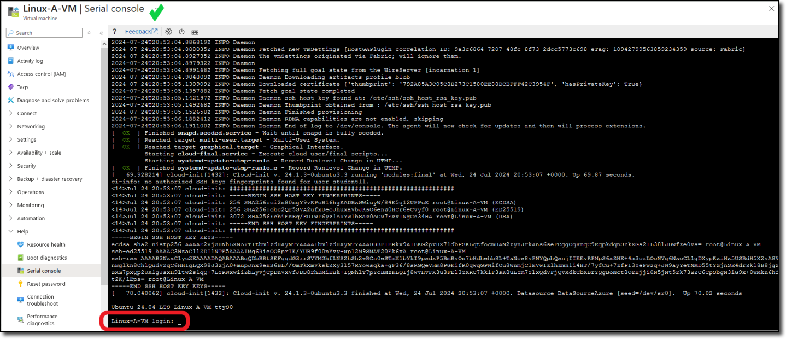

Now that you have created the virtual machines, **Linux-A-VM** and **Linux-B-VM**, you are going to identify their assigned public IP (PIP), confirm access to the Internet, and connectivity between each VM via their assigned subnets.

 Access the serial console of both virthal machines in differant tabs.

- 1. Navigate into your Resource Group and right click on the virtual machine **Linux-A-VM**.  Select **Open Link in New Tab**  
  
    
You will see the **Linux-A-VM** Overview page in a new tab.

- 2. Under the **Essentials** and **Properties** sections, right hand side, identify the assigned private and public IP of **Linux-A_VM**
        - Navigate to the bottom left of the screen, expand the **Help** menu, and select **Serial console**.

You will be redirected to the **Linux-A-VM | Serial Console** screen.

- 3. Login to the **Linux-A-VM** console using the credentials you used when creating the **Linux-A-VM**.

- 4. Return to the **studentxx-azure102-rg** tab and right click on the virtual machine **Linux-B-VM**.  Select **Open Link in New Tab**  

You will see the **Linux-B-VM** Overview page in a new tab.

- 5. Under the **Essentials** and **Properties** sections, right hand side, identify the assigned private and public IP of **Linux-B-VM**
        - Navigate to the bottom left of the screen, expand the **Help** menu, and select **Serial console**.

You will be redirected to the **Linux-B-VM | Serial Console** screen.

- 6. Login to the **Linux-B-VM** console using the credentials you used when creating **Linux-B-VM**.

The goal of steps seven and eight are to note what ports are open and listening on each VM, what access does each VM have accross subnets, and what access to and from the Internet each VM has exposed.  With this information, we can start developing security policies to implement when securing the VNET in the next module - **Securing the VNET**.  

**Linux-A-VM** will be the management server.  It will have SSH access to **Linux-B-VM** and only port 80 access to the Internet.  There will be SSH access to **Linux-A-VM** from the Internet. 

**Linux-B-VM** will be the www server and publishing port 80 services to the Internet.  It will have 80 and 443 access to the Internet but no access to **Linux-A-VM**.

**Make sure to configure **Linux-B-VM** first - Step seven**
7. From the **Linux-B-VM** CLI:
        - a. Ping www.yahoo.com and confirm DNS and ICMP access to the internet:  "**ping www.yahoo.com**" (CTRL+c to stop ping)
        - Confirm port 80 access to the Internet:  "**wget www.fortinet.com**".  (Confirm "200 OK" response)
        - Confirm port 443 access to the Internet and the public IP assigned to **Linux-B-VM**: "**curl https://ipinfo.io/ip**".  (Confirm against what the Azure portal listed in step five above)
        - Check for Ubuntu updates and install them:  
                - "**sudo apt update**"
                - "**sudo apt upgrade**" and select "**Y**".
                - Type "**clear**" after the updates have finished.
        - Install the web service **NGINX**:  "**sudo install nginx**" and select "**Y**".
     - Checking access to **Linux-A-VM**:
        - Ping the private IP of **Linux-A-VM** and confirm replies.  (See step two above for IP)
        - Install **NMAP**:  "**sudo apt install nmap**" and select "**Y**"
        - Scan open ports on **Linux-A-VM**:  "**nmap -F 192.168.1.xxx**"  (See step two above for IP)
        Note the open port(s) on **Linux-A-VM**.
        - Confirm SSH access to **Linux-A-VM** and login:  **ssh studentxx@192.168.1.xxx**"
                - Run "**sudo ss -ltn**" to confirm the same open ports that NMAP reported.
                - Type **exit** to disconnect from **Linux-A-VM**.

- 8. From the **Linux-A-VM** CLI:
        - Ping "**www.yahoo.com**" and confirm replies.  (CTRL+c to stop ping)
        - Confirm port 80 access to the Internet:  "**wget www.fortinet.com**"
        - Confirm port 443 access to the Internet and the public IP assigned to **Linux-A-VM**: "**curl https://ipinfo.io/ip**"
        - Check for Ubuntu updates and install them:  
                - "**sudo apt update**"
                - "**sudo apt upgrade**" and select "**Y**".
                - Type "**clear**" after the updates have finished.
        - Ping the private IP of **Linux-B-VM** and confirm replies.  (Note step five above)
        - Install **NMAP**:  "**sudo snap install nmap**"
        - Scan open ports on **Linux-B-VM**:  "**nmap -F 192.168.1.xxx**"  (Note step five above for xxx)
        Note the open port(s) on **Linux-B-VM**.
        - Confirm SSH access to **Linux-B-VM** and login:  **ssh studentxx@192.168.1.xxx**"
                - Run "**sudo ss -ltn**" to confirm the same open ports that NMAP reported.
                - Type **exit** to disconnect from **Linux-B-VM**.

What do steps 7 and 8 above tell you about access to/from the Internet to both Linux VMs?
What do steps 7 and 8 above tell you about access between each Linux VM in different subnets?
