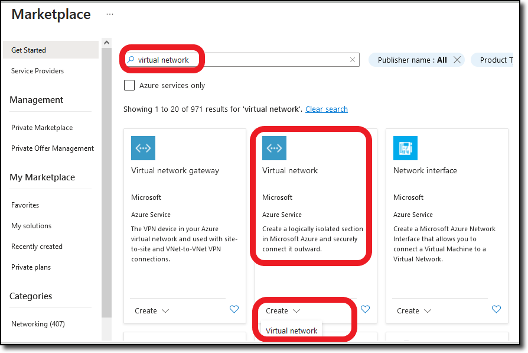
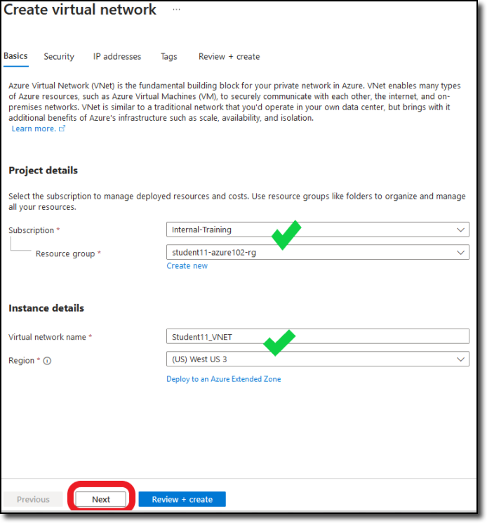
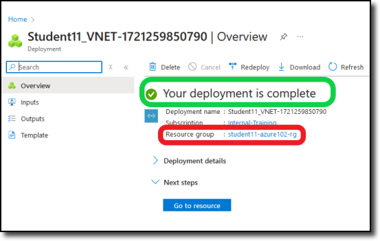

In Task 1, you will deploy VNET (Virtual Network) in the training **Resource Group** that you have been assigned to.

1. Navigate into your Resource Group and click on the **+ Create** located at the top left of the tool bar.

      

    You will be redirected to the Azure Marketplace.

1. In the Marketplace search bar

    - Enter **Virtual Network** and then enter
    - Navigate to the **Virtual Network** offering from Microsoft
    - Select **Create** and **Virtual network**.

    

    You will be redirected to the **Create virtual network** template.

1. Under the **Basics** tab, the **Subscription** and **Resource Groups** should already be filled in with your assigned info.  If not, see the screen shot below for details.

    - Under **Instance details**, enter the following:

        - Virtual network name: "**Studentxx_VNET**" (Replace "**xx**" with your assigned student number)
        - Region: "**(US) West US 3**"

    - Click **Next**.

    

1. On the **Security** tab, make sure **none** of the services are selected and click **Next**.
Feel free to read through the available services that can be enabled.

1. On the **IP address** tab, edit the default address space to "**192.168.1.0/24**".

    - Select the edit button (Red) next to the "default" subnet and, in the new window to the right, update the following info:  

        - Name:  "**External_Subnet**"
        - Starting address:  "**192.168.1.0**"
        - Size: "**/27**"

    - Select **Save**

        

    - Select **+ Add a subnet** (see red below), and add the following info:

        

1. Continue to **+ Add a subnet**

    - Add "**Protected-A_Subnet**"
    - Add "**Protected-B_Subnet**"

        With their respective subnets. See the diagram below for **IP address range** assignments.  

    - Click **Next**.

    

1. On the **Tags** tab, click **Next**.

1. On the **Review + create** tab

    - confirm the template summary and select **create**.

    

1. When the deployment is complete, you will get a **Your deployment is complete** notice.

    - Confirm your deployment has completed and under **Resource group** select the "**studentxx-azure102-rg**" link.  See red section below.

    

1. Your screen should return you to your respective resource group with the new virtual network listed.  Feel free to click on the new virtual network and look around.

    

1. You have just created an **Azure virtual network (VNET)**.  The diagram below is a visual representation of your new VNET.

    

**Continue to Chapter 4 - Task 2: Deploy Linux Virtual Machines (VMs).**
