In the following task, you will deploy a FortiGate network virtual appliance (NVA)in the training Resource Group that you have been assigned.  After deployment, you will login to the FortiGate and verify a few settings.

- **Creation Steps**
- 1. Navigate into your Resource Group and click on the **+ Create** located at the top left of the tool bar.
  

You will be redirected to the Azure Marketplace.

- 2. In the Marketplace search bar, enter **Fortinet FortiGate** and then enter.  Navigate to the **Fortinet FortiGate Next-Generation Firewall** offering from Fortinet and select **Create** and **Single VM**.
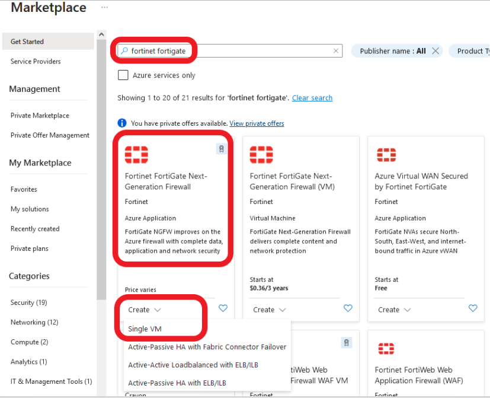

You will be redirected to the **Create Single VM** template.

- 3. Under the **Basics** tab, the **Subscription** and **Resource Groups** should already be filled in with your assigned info.  If not, see the screen shot below for details.
- Under **Instance details**, select/enter the following:
    - **Region**:  "**West US 3**"   
    - **FortiGate administrative username**:  "**studentxx**"
    - **FortiGate password**/**Confirm password**:  "**FortinetAzure2024!**"
    - **Fortigate Name Prefix**:  "**studentxx**"
    - **Fortigate Image SKU**:  "**Pay As You Go**"
    - **Fortigate Image Version: "**7.4.4**"
- Select **Next**.
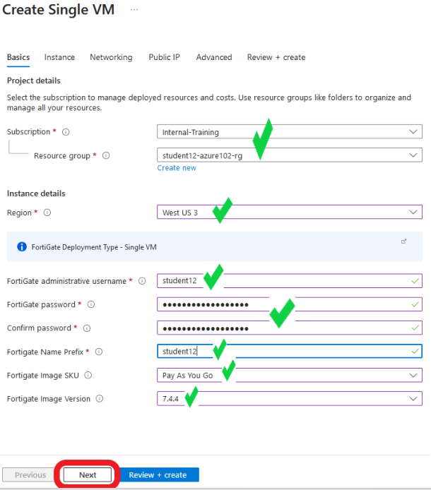

- 4. On the **Instance** tab, review the default entries.  Note the two blue shaded areas under **FortiGate License** for future knowledge.
- Select **Next**.
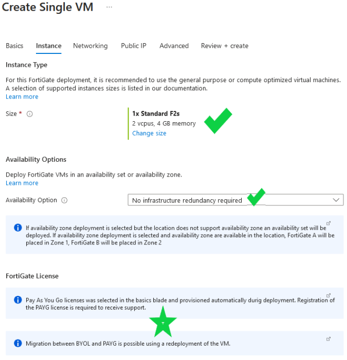

- 5. On the **Networking** tab, enter/edit the following:
    - **Virtual network**:  "**Studentxx_VNET (studentxx-azure102-rg)**".  (Do not select the option with the prepended (NEW)).
    - **External Subnet**:  "**External_Subnet**"
    - **Internal subnet**:  "**Internal_Subnet**"
    - **Protected subnet**:  "**Protected-A_Subnet**"
    - **Accelerated Networking**:  "**Enabled**"
- Select **Next**.
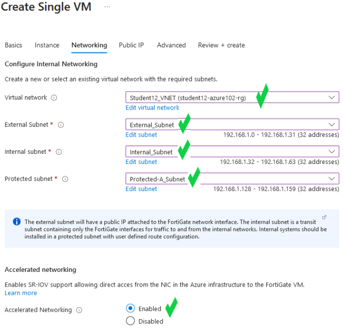

- 6.  On the **Public IP** tab, keep the default **Public IP address** already entered.  It should have a "**(new)**" listed in the beginning of the field.
- Select **Next**

- 7. On the **Advanced** tab, keep the default settings.  Note the option for the FortiGate to be managed by a FortiManager.
-Select **Next**.
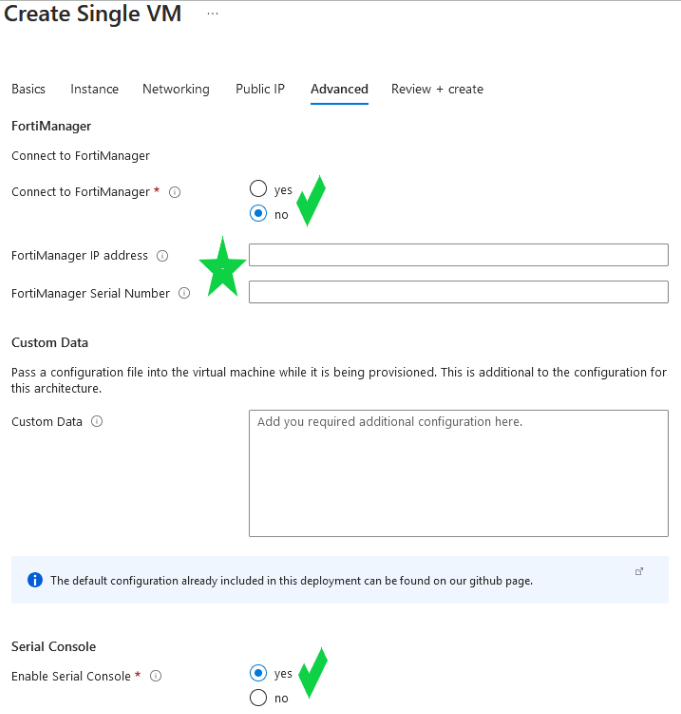

- 8.  On the **Review + create** tab, scroll down and review the template entries.
- Select **Create**.
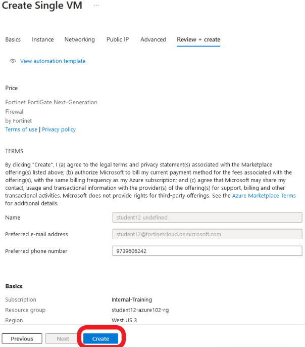

- 9.  The screen should refresh and you will see **Deployment is in progress**.

- 10. After a few minutes, you will see **Your deployment is complete**.  Select **Go to resource group**
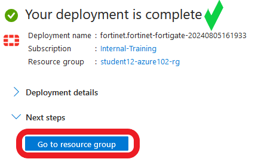

- 11. Confirm the FortiGate NVA and its related services have been deployed.

- 12.  Select **studentxx-FGT** and the Overview page will be displayed.  Look under the **Properties** tab/Networking section (mid screen, right hand column) and identify the **Public IP address** and **Private IP address**.  This information is redundant and listed in several places.  (See right hand column under **Essentials**)
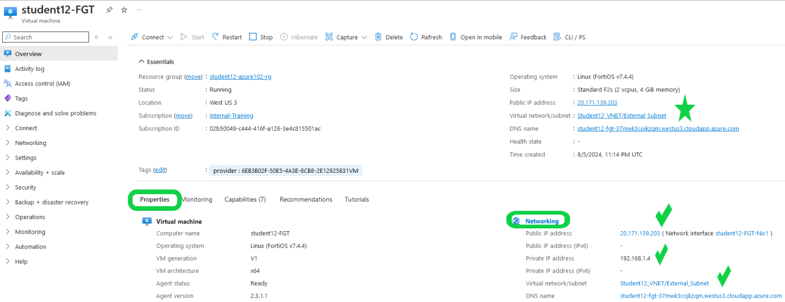

- 13.  Copy and paste the **Public IP address** into your local browser and you should be directed to the FortiGate NVA login page.  Don't forget to prefix the **Public IP address** with **https://**

- 14. Enter the login info you created in **Step 3** above.  You will be presented with the **FortiGate Setup** page.  Click **Begin**.  On the **What's new in FortiOS 7.4** video, select **Don't show again** and **OK**.
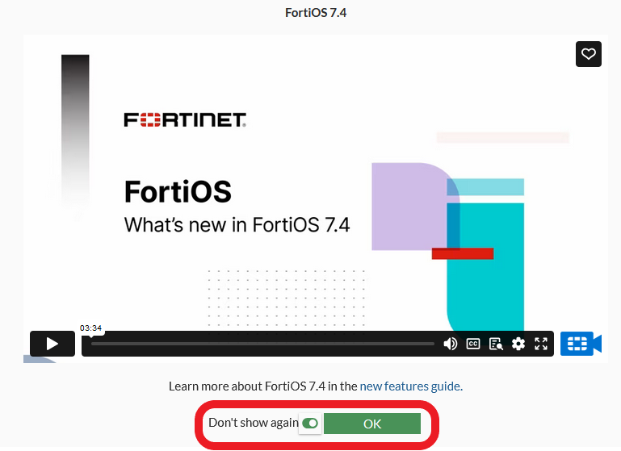

- 15.  Look around and get familiar with the **Dashboard/Status** page.  Note items such as the **Virtual Machine** widget with the PAYGO license, **Firmware** version, and **WAN IP**.
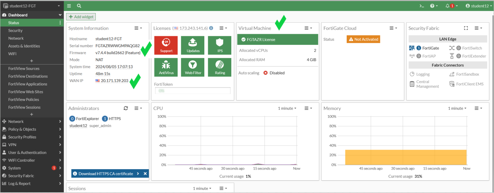

- 16. Navigate on the left to **Network** and **Interfaces**.  Note the **port1** and **port2** interfaces and assigned private IP address.  
- **Why did they get assigned these subnets?**
Note the private IP address for both **port1** and **port2**.  You will need this info for future tasks.
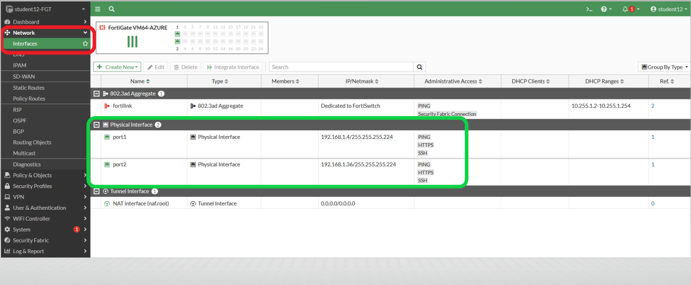

- 17. Feel free to continue looking around the FortiGate GUI and see if you notice screens that are differant compared to a hardware FortiGate GUI.

**Continue to Chapter Four - Task Two: Deploy a Route Table and Create a UDR**