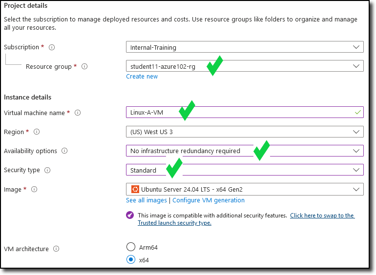

Now that a **VNET** is configured, Task 2 will cover

- Deploying two Linux VMs in the VNET
- Identify assigned public IP (PIP)
- Confirm access to the Internet
- Confirm access between each VM

VM - **Linux-A-VM** will be assigned to the **Protected-A_Subnet**
VM - **Linux-B-VM** will be assigned to the **Protected-B_Subnet**

#### Steps to create Linux-A-VM

1. Navigate into your Resource Group and click on the **+ Create** located at the top left of the tool bar.

      

    You will be redirected to the Azure Marketplace.

1. In the Marketplace search bar, enter **ubuntu 24.04 lts** and then enter.  Navigate to the **Ubuntu 24.04 LTS - all plans including Ubuntu Pro** offering from **Canonical** and select **Create** and **Ubuntu Server 24.04 LTS**.

    

    You will be redirected to the **Create a virtual machine** template.

1. Under the **Basics** tab, update the following fields:

    (Leave the default entry of the other fields not listed here)
        - Resource group:  "**studentxx-azure102-rg**"
        - Virtual machine name:  "**Linux-A-VM**"
        - Availability options:  "**No infrastructure redundancy required**"
        - Security type:  "**Standard**"
        - Size:  Select "**See all sizes**"

    

     - On the **Select a VM size** screen, expand the **D-Series v5** section and select "**D2as_v5**" and then click **Select**

    

    - Continuing from the **Create a virtual machine** screen:

        - **Authentication type**:  "**Password**"
        - **Username**:  "**studentxx**"  (Replace xx with your student number)
        - **Password**:  "**FortinetAzure2024!**" (Same as your Azure portal login)
        - **Confirm password**:  "**FortinetAzure2024!**"

1. Confirm the changes and the other fields default entries match the following diagram.

    

    

    

1. Select **Next: Disks >**.

1. On the **Disk** tab, keep the default settings and click **Next: Networking >**.
Feel free to read through the available disk services that can be changed/enabled.

1. Under the **Networking** tab, update the following fields: (Leave the default entry of the other fields not listed here)

    - **Virtual network**:  "**Studentxx_VNET**"
    - **Subnet**:  "**Protected-A_Subnet (192.168.1.128/27)**"
    - **Public IP**:  Select **Create new**

    - On the new **Create public IP address** on the right, enter the following:
        - **Name**:  "**Linux-A-VM_PIP**"
        - **Routing preference**:  "**Internet**"
        - Select **OK**
    - **Delete public IP and NIC when VM is deleted**:  **Select**

1. Confirm the changes and the other fields default entries match the following diagram.

    
    

1. Select **Review + create >**.

1. Feel free to read through the **Management**, **Monitoring**, **Advanced**, and **Tags** tabs for additional services that can be changed/enabled.

1. Confirm the template validation has passed and select **Create**

    

1. The **Deployment is in progress** notice is displayed.

    

1. Once the **Your deployment is complete** notice is displayed, click on the **student11-azure102-rg** link to be re-directed to your resource group.

    

1. Verify the new **Linux-A-VM** and the associated components are listed.

    

#### Steps to create Linux-B-VM

1. Follow the same 1-14 steps above to create the **Linux-B-VM**. You will need to alter the following where appropriate:
            - **Virtual machine name**:  "**Linux-B-VM**"
            - **Subnet**:  "**Protected-B_Subnet (192.168.1.160/27)**"
            - **Public IP**:  Select **Create new**
        - On the new **Create public IP address** on the right, enter the following:
            - **Name**:  "**Linux-B-VM_PIP**"

1. Verify the new **Linux-B-VM** and the associated components are listed.

    

**Continue to Chapter 4 - Task 3: Identify VM info and Unsecured Services**
