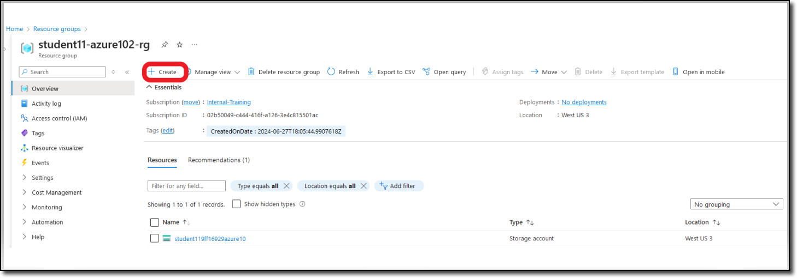
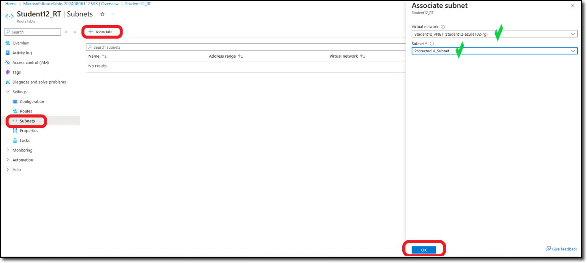

In Task Two, you will deploy a **Route Table** and modify the **Route Table** by associating both protected subnets to use **port2** of the FortiGate as the default route. This is what is called a **User Defined Route (UDR)**.

1. Navigate into your Resource Group and click on the **+ Create** located at the top left of the tool bar.

      

    You will be redirected to the Azure Marketplace.

1. In the Marketplace search bar, enter **route table** and then enter.  Navigate to the **Route table** offering from Microsoft and select **Create** and **Route table**.

    

    You will be redirected to the **Create Route table** template.

1. Under the **Basics** tab, the **Subscription** and **Resource Groups** should already be filled in with your assigned info.  If not, see the screen shot below for details.

    - Under **Instance details**, enter the following:
        - **Region**: "**West US 3**"
        - **Name**: "**Studentxx_RT**" (Replace xx with your assigned student number)
        - **Propagate gateway routes**:  "**No**"
    - Select **Next**.

    

1. On the **Tags** tab, click **Next**.  Nothing to enter here.

1. On the **Review + create** tab, confirm your entries under **Basics** and then select **create**.

    

1. The screen should refresh and you will see **Deployment is in progress**.

1. After a few minutes, you will see **Your deployment is complete**.  Select **Go to resource**.  You will be directed to the **Studentxx_RT** Overview page.

    

1. Take a few moments and familiarize yourself with the route table **Overview** page.  

    **In the next few steps, you will be creating a UDR**

1. From the **Studentxx_RT** **Overview** page, navigate to **Settings** and then **Routes**.
From the **Routes** page, select **+ Add**.

    

1. The **Add route** will display on the right.  Enter the following:

    - **Route name**:  "**Default**"
    - **Destination type**:  "**IP Address**"
    - **Destination IP address/CIDR ranges**:  "**0.0.0.0/0**"
    - **Next hop type**: "**Virtual appliance**"
    - **Next hop address**:  "**192.168.1.36**"  (Confirm this is the same IP assigned to **port2** on your FortiGate NVA).
    - Select **Add**

    

1. You will see the new route called **Default** listed under the **Routes** section.

    

1. Continue to add two more routes for **Protected-A-Subnet** and **Protected-B-Subnet**.

    

1. When finished, the **Routes** page should have the three routes listed.  See the following diagram for confirmation.

    

1. On the left hand side, select **Subnets** and **+ Associate**.  The **Associate subnet** page will display on the right.  Enter the following:

    - **Virtual network**:  "**Studentxx_VNET**"  (Replace xx with your assign student number)
    - **Subnet**: "**Protected-A_Subnet**"
    - Select **OK**.

    

1. Click **+ Associate** again and add the **Protected-B_Subnet**.  You should have both subnets listed under the **Subnets** tab.

    

1. Return to the **Overview** page to see a summary of the **Routes** and associated **Subnets**.

    

**Continue to Chapter 5 - Task 3: Confirm Linux VMs access via FortiGate**
